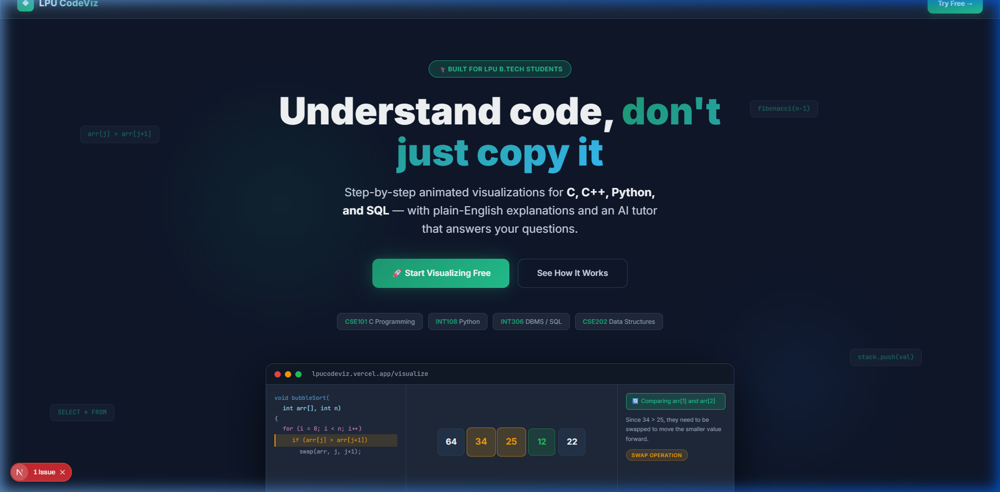
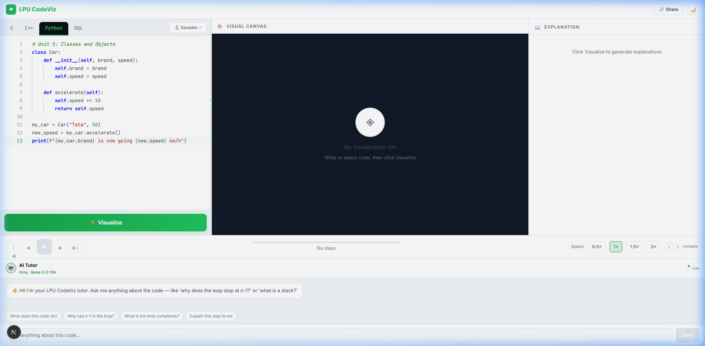
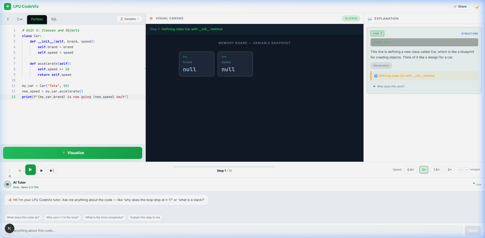
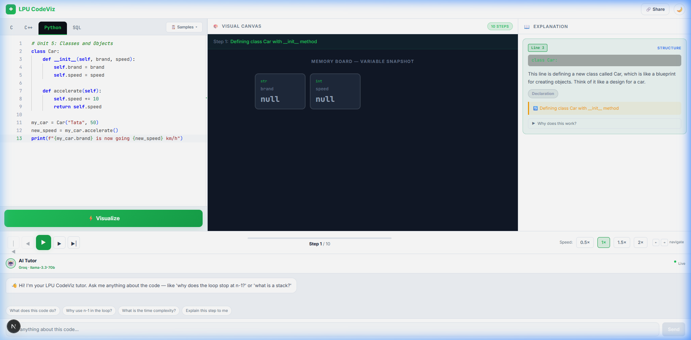

# LPU CodeViz

  

## 💡 Why I Built This

**Developed by Prathamesh Sawarkar (Registration ID: 12509401)**

When I started coding, I realized that many students struggle because they don't have any initial knowledge about how code actually executes in memory. Popular platforms like GeeksForGeeks are great, but they can be a bit tricky and overwhelming for beginners who just need to see exactly what each line does.

I created **LPU CodeViz** so students can visually step through their C, C++, Python, and SQL programs. By seeing variables change, stacks pop, and arrays sort in real-time, learning becomes intuitive rather than intimidating.

---

## 📸 Platform Previews

### Dark Mode Execution Environment

### Light Mode & Built-in Sharing

### Real-Time Python Tracing (Variables & Scope)

---

## ⚙️ How It Works in Deep

The platform bridges the gap between static code and dynamic execution through a seamless, dual-layer architecture:

### 1. The React/Next.js Frontend Canvas
When you type code into the Monaco Editor, our frontend parses the current state. Depending on the selected topic (e.g., Arrays, Sorting, SQL), a **Bespoke Visual Canvas Component** is rendered. For instance, `SortingViz` renders D3/Framer-style SVG bars, while `VariableBoard` tracks key-value mappings for Python. 

### 2. The FastAPI & Groq LLM Backend
Instead of dangerously executing unknown C or Python code directly on our servers (which creates massive security vulnerabilities), we use **AI-Simulated Tracing**. 
When you click "Visualize":
1. The code is packaged and sent to our Python FastAPI backend.
2. The backend communicates with the **llama-3.3-70b-versatile** model via Groq.
3. The LLM acts as an execution engine, outputting a strict JSON array of *State Snapshots*. Every snapshot represents one line of execution, detailing the updated variables, the current line number, and a plain-English explanation of what happened.

### 3. Step-by-Step Playback
The frontend receives this array of snapshots and feeds it into the `StepController`. As you click "Next", the visualizer transitions smoothly from State *N* to State *N+1*, animating the change (like swapping two bars in Bubble Sort) while the **AI Tutor Sidebar** highlights the exact line of code and explains the logic.

---

## 🚀 Features

- **9 Animated Visualizers:** Arrays, Sorting, Stacks, Queues, Linked Lists, Binary Trees, Recursion Call Stacks, SQL Tables, and Variable Boards.
- **Syllabus Aligned:** Pre-loaded with 20+ examples perfectly mapped to LPU courses CSE101 (C), INT108 (Python), and INT306 (DBMS).
- **Start from Zero:** Designed for absolute beginners with examples starting from basic variable initialization and loops.
- **AI Tutor Chat:** Stuck on a concept? Just ask the built-in AI Tutor for help directly in the interface.
- **One-Click Sharing:** Instantly share your code with classmates using base64-encoded URL sharing.

## 🛠️ Tech Stack

- **Frontend:** Next.js 14, React, Framer Motion, Monaco Editor, Tailwind CSS
- **Backend:** FastAPI, Python, Groq LLM API
- **Deployment:** Vercel (Frontend), Railway (Backend)

## 🚦 How to Run Locally

1. Clone the repository:
   \`\`\`bash
   git clone https://github.com/LTPratham/LPU-CodeViz.git
   cd LPU-CodeViz
   \`\`\`

2. Add your Groq API Key:
   - Copy `backend/.env.example` to `backend/.env`
   - Add your API key: `GROQ_API_KEY=your_key_here`

3. Run the startup script (starts both frontend and backend):
   \`\`\`powershell
   .\start.ps1
   \`\`\`

4. Open your browser to `http://localhost:3000`

## 📧 Contact
For any questions or feedback, reach out to me at: **prathameshsawarkar1@gmail.com**
