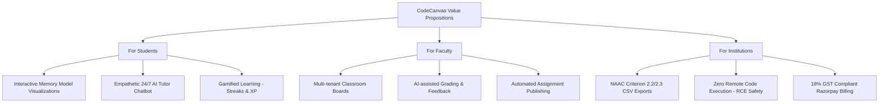

# Product Requirements Document (PRD) — CodeCanvas

## Document Control & Metadata

| Field | Details |
| :--- | :--- |
| **Product Name** | CodeCanvas (LPU CodeViz) |
| **Document Version** | v2.0 (Industry-Grade Specification) |
| **Status** | Approved |
| **Owner / Author** | Prathamesh Sawarkar (Registration ID: 12509401) |
| **Target Institutions** | Lovely Professional University (LPU) - CSE/IT Department |
| **Last Updated** | August 3, 2026 |

### Revision History

| Version | Date | Author | Description of Changes |
| :--- | :--- | :--- | :--- |
| v1.0 | July 7, 2026 | Prathamesh Sawarkar | Initial draft & MVP features definition. |
| v2.0 | August 3, 2026 | Prathamesh Sawarkar | Expanded to B2B enterprise specs, detailed API schemas, NAAC audits, DPDP Act 2023 controls, and Razorpay GST invoicing flows. |

---

## 1. Executive Summary & Product Vision

### 1.1 Product Vision
CodeCanvas is an AI-powered code visualization and interactive tutoring SaaS platform designed specifically for higher education engineering colleges and universities in India. At its core, CodeCanvas bridges the critical gap between abstract programming concepts (memory models, variable state mutations, sorting algorithms, and database operations) and practical execution. It replaces standard command-line debuggers (like GDB/PDB) with an animated visual canvas, reducing student drop-out rates in computer science labs while automating accreditation audit documentation (NAAC/NBA).

### 1.2 Core Business Value Propositions



---

## 2. Key Performance Indicators (KPIs) & Product Success Metrics

To ensure product efficacy, system performance, and business alignment, the following metrics will be tracked:

### 2.1 Student Engagement Metrics
- **Daily Active Users / Monthly Active Users (DAU/MAU)**: Target $\ge 40\%$ within participating college cohorts.
- **Trace Completion Rate**: Percentage of started visual code sessions stepped through to completion (Target $\ge 85\%$).
- **Retention & Streak Maintenance**: Percentage of active students maintaining a $\ge 5$-day coding streak (Target $\ge 30\%$).

### 2.2 Pedagogical Outcomes
- **Concept Comprehension Gain**: Pre- vs. post-test performance differences after using specific visualizer canvases (Target $\ge 25\%$ improvement).
- **AI Grading Correlation**: Statistical correlation coefficient ($r$) between AI-assigned grades and teacher-overridden grades (Target $r \ge 0.85$).
- **AI Chat Success Rate**: Percentage of AI Tutor chat sessions resolved without escalations to instructors (Target $\ge 90\%$).

### 2.3 Technical & SLA Metrics
- **API Call Latency (Trace Generation)**: Response time for llama-3.3-70b-versatile via Groq to return JSON execution state arrays (Target $\le 2.0$ seconds at $95\text{th}$ percentile).
- **UI Animation Smoothness**: Frame rate of Framer Motion visualizer step transitions (Target $\ge 60$ fps).
- **System Availability (Uptime)**: SLA target of $99.99\%$ availability.
- **API Cache Hit Ratio**: Percentage of identical student code templates resolved via caching layer (Target $\ge 45\%$).

---

## 3. Personas & Stakeholder User Scenarios

The user experience is designed around three primary personas:

### 3.1 Aarav — The 1st Year Engineering Student (CS/IT)
- **Profile**: Struggles to comprehend memory models (e.g., how values swap in bubble sort or where pointers refer in linked lists). Finds native debugger terminals confusing.
- **Scenario**: At 11:30 PM, Aarav writes a recursive function for binary search. He gets stuck in an infinite recursion loop. Instead of failing, he enters the code in CodeCanvas. He steps through the visual recursion call stack, sees the stack frames growing without hitting the base case, and fixes the bug himself with the help of the AI Tutor sidebar.

### 3.2 Dr. Meera — CS Department Lab Professor
- **Profile**: Manages 4 lab sections with over 240 students. Overwhelmed by grading identical code submissions and compiling manual course file evidence.
- **Scenario**: Dr. Meera sets up a class on CodeCanvas and shares the invite code. She publishes a custom "Linked List Reversal" assignment. The students submit their code. CodeCanvas auto-grades the step traces, flags templates that match unmodified sample files, and populates a grading dashboard. Dr. Meera reviews grades, overrides three AI scores, and exports the lab progression file.

### 3.3 Dean Dr. Sharma — Institutional Administrator & NAAC Evaluator
- **Profile**: Focuses on increasing placement results, passing NBA/NAAC audits, and maintaining data privacy compliance across the university.
- **Scenario**: During a NAAC audit, Dr. Sharma needs to present documentation for Criterion 2.3.1 (experiential learning methods). He logs into the HOD dashboard, filters by course code `CSE-101`, and downloads a certified CSV detailing student active learning traces, assignment scores, and streak telemetry.

---

## 4. MoSCoW Feature Matrix & Prioritization

The platform features are mapped using the MoSCoW framework to delineate immediate MVP deliverables from B2B institutional upgrades:

### 4.1 Must-Have (MVP Scope)
- **Monaco Code Editor**: Web-based IDE shell supporting syntax parsing, autocomplete, and theme toggling.
- **AI-Simulated Visualizer Engine**: FastAPI middleware translating source code into structured JSON state traces via Groq.
- **10 Visualizer Canvases**: Dynamic components representing Stacks, Queues, Arrays, Sorting, Recursion, Linked Lists, Trees, Graphs, Relational SQL tables, and general Variable Boards.
- **Interactive Graph Canvas**: Drag-and-drop workspace generating code structures dynamically.
- **AI Tutor Chatbot Panel**: Interactive, context-aware chatbot guiding students through traces without revealing direct answers.
- **Shareable Base64 Links**: Serialization of code state into URL-addressable parameters.

### 4.2 Should-Have (Phase 2 - Institutional Upgrade)
- **Multi-Tenant Classroom Management**: Teachers register classes, generate invite codes, and manage rosters.
- **Assignment Builder & Roster Grader**: Publishing starter templates, tracking deadlines, and grading telemetry.
- **NAAC/NBA Export Engine**: Roster analytics and telemetry logs download as CSV/PDF files.
- **Vernacular translations**: Local UI language switcher (English, Hindi, Tamil, Telugu, and Marathi).

### 4.3 Could-Have (Phase 3 - SaaS Advanced Ecosystem)
- **Cryptographic Certificate Generator**: Secure certification generation for students showing DSA mastery.
- **LTI 1.3 LMS Passback**: Roster and grade syncing with Canvas, Moodle, and Google Classroom.
- **Gamified Coding Arenas**: Peer-to-peer coding competitions (Algorithm Battleground) with real-time commentary.

### 4.4 Won't-Have (Future Phase)
- **Native Android/iOS Mobile Apps**: Deferred in favor of responsive Progressive Web Apps (PWA) running client-side.

---

## 5. Technical Architecture & Data Specifications

### 5.1 System Architecture

```
[ Next.js App Router (Vercel) ] <== HTTPS ==> [ FastAPI Server (Railway) ]
        ||                                             ||
      OAuth / SQL                                     Groq API
        ||                                             ||
[ Supabase PostgreSQL & RLS ]                 [ Llama 3.3 70B Model ]
```

### 5.2 Database Schema & Entity Relationships

The relational database is configured on Supabase (PostgreSQL) with Row Level Security (RLS) policies. Refer to the SQL file [supabase_migration.sql](file:///d:/projects/LPU%20CodeViz/supabase_migration.sql) for details.

#### 5.2.1 Profiles Table (`profiles`)
Extends standard `auth.users` to manage user roles and gamification mechanics.
- `id` (UUID, Primary Key -> references `auth.users(id)` ON DELETE CASCADE)
- `full_name` (TEXT)
- `avatar_url` (TEXT)
- `role` (TEXT, NOT NULL DEFAULT 'student' CHECK (role IN ('student', 'teacher', 'hod', 'admin')))
- `school_id` (TEXT, DEFAULT 'cse')
- `xp` (INTEGER, NOT NULL DEFAULT 0)
- `streak_days` (INTEGER, NOT NULL DEFAULT 0)
- `last_active` (DATE)
- `created_at` (TIMESTAMPTZ, DEFAULT NOW())

#### 5.2.2 Classrooms Table (`classrooms`)
Stores courses created by faculty.
- `id` (UUID, Primary Key DEFAULT gen_random_uuid())
- `teacher_id` (UUID, NOT NULL REFERENCES profiles(id) ON DELETE CASCADE)
- `name` (TEXT, NOT NULL)
- `course_code` (TEXT)
- `school_id` (TEXT, DEFAULT 'cse')
- `invite_code` (TEXT, UNIQUE DEFAULT upper(substring(gen_random_uuid()::text, 1, 8)))
- `description` (TEXT)
- `created_at` (TIMESTAMPTZ, DEFAULT NOW())

#### 5.2.3 Enrollments Table (`enrollments`)
Links students to classrooms. Unique constraint on `(classroom_id, student_id)`.
- `id` (UUID, Primary Key DEFAULT gen_random_uuid())
- `classroom_id` (UUID, NOT NULL REFERENCES classrooms(id) ON DELETE CASCADE)
- `student_id` (UUID, NOT NULL REFERENCES profiles(id) ON DELETE CASCADE)
- `enrolled_at` (TIMESTAMPTZ, DEFAULT NOW())

#### 5.2.4 Assignments Table (`assignments`)
Coding assignments published by instructors.
- `id` (UUID, Primary Key DEFAULT gen_random_uuid())
- `classroom_id` (UUID, NOT NULL REFERENCES classrooms(id) ON DELETE CASCADE)
- `title` (TEXT, NOT NULL)
- `description` (TEXT)
- `algorithm` (TEXT)
- `sample_code` (TEXT)
- `lang` (TEXT, DEFAULT 'python')
- `deadline` (TIMESTAMPTZ)
- `max_xp` (INTEGER, DEFAULT 50)
- `created_at` (TIMESTAMPTZ, DEFAULT NOW())

#### 5.2.5 Submissions Table (`submissions`)
Student solutions, output execution traces, grades, and feedback.
- `id` (UUID, Primary Key DEFAULT gen_random_uuid())
- `assignment_id` (UUID, NOT NULL REFERENCES assignments(id) ON DELETE CASCADE)
- `student_id` (UUID, NOT NULL REFERENCES profiles(id) ON DELETE CASCADE)
- `code` (TEXT)
- `steps_json` (JSONB)
- `explanation` (TEXT)
- `ai_grade` (INTEGER)
- `ai_feedback` (TEXT)
- `teacher_grade` (INTEGER)
- `submitted_at` (TIMESTAMPTZ, DEFAULT NOW())
- UNIQUE(assignment_id, student_id)

#### 5.2.6 Trace History Table (`trace_history`)
Logs student execution history for analytics.
- `id` (UUID, Primary Key DEFAULT gen_random_uuid())
- `user_id` (UUID, REFERENCES profiles(id) ON DELETE SET NULL)
- `lang` (TEXT)
- `code` (TEXT)
- `steps_json` (JSONB)
- `data_structure` (TEXT)
- `school_id` (TEXT)
- `step_count` (INTEGER)
- `created_at` (TIMESTAMPTZ, DEFAULT NOW())

### 5.3 Core API Request-Response Contracts

#### 5.3.1 Visualizer Trace Endpoint (`POST /api/trace`)
Translates student source code into structured JSON execution steps.

**Request Payload:**
```json
{
  "code": "def search(arr, target):\n    for i in range(len(arr)):\n        if arr[i] == target:\n            return i\n    return -1\nsearch([10, 20, 30], 20)",
  "lang": "python",
  "data_structure": "sorting"
}
```

**Response Payload:**
```json
{
  "success": true,
  "data_structure_type": "sorting",
  "steps": [
    {
      "line_number": 1,
      "explanation": "Function 'search' is defined. Arguments are mapped: arr=[10, 20, 30], target=20.",
      "variables": {
        "arr": [10, 20, 30],
        "target": 20
      },
      "data_structure_state": {
        "type": "sorting",
        "array_state": [10, 20, 30],
        "highlighted_indices": [],
        "operation": "initialize"
      }
    },
    {
      "line_number": 2,
      "explanation": "Starting loop. i is initialized to 0. i is less than len(arr).",
      "variables": {
        "arr": [10, 20, 30],
        "target": 20,
        "i": 0
      },
      "data_structure_state": {
        "type": "sorting",
        "array_state": [10, 20, 30],
        "highlighted_indices": [0],
        "operation": "compare"
      }
    },
    {
      "line_number": 3,
      "explanation": "Checking condition: arr[0] (10) == target (20). This evaluates to False. i is incremented to 1.",
      "variables": {
        "arr": [10, 20, 30],
        "target": 20,
        "i": 1
      },
      "data_structure_state": {
        "type": "sorting",
        "array_state": [10, 20, 30],
        "highlighted_indices": [1],
        "operation": "compare"
      }
    },
    {
      "line_number": 4,
      "explanation": "Checking condition: arr[1] (20) == target (20). This evaluates to True. Returning index 1.",
      "variables": {
        "arr": [10, 20, 30],
        "target": 20,
        "i": 1
      },
      "data_structure_state": {
        "type": "sorting",
        "array_state": [10, 20, 30],
        "highlighted_indices": [1],
        "operation": "return"
      }
    }
  ]
}
```

#### 5.3.2 AI Tutor Chat Endpoint (`POST /api/tutor/chat`)
Generates context-aware, educational hint responses for struggling students.

**Request Payload:**
```json
{
  "code": "def search(arr, target):\n    for i in range(len(arr)):\n        if arr[i] == target:\n            return i\n    return -1",
  "current_line": 3,
  "data_structure": "sorting",
  "variables": {
    "arr": [10, 20, 30],
    "target": 20,
    "i": 0
  },
  "user_message": "Why does the loop check arr[0] first?"
}
```

**Response Payload:**
```json
{
  "response": "In Python, arrays and lists are 0-indexed. This means range(len(arr)) starts checking from index 0 (which is the first element, 10). Take a look at your variables sidebar: what is the current value of i?",
  "hint_type": "conceptual",
  "suggested_actions": ["check_variables_sidebar", "step_next"]
}
```

---

## 6. Non-Functional Requirements (NFRs)

- **Performance & Latency SLAs**: Visual state transitions (renders) must resolve within $16.67\text{ ms}$ (maintaining $60\text{ fps}$). Page load time for dashboards must be $\le 1.5\text{ seconds}$ on standard $4\text{G}$ network profiles.
- **Accessibility Compliance (WCAG 2.1 AA)**: The frontend user interface must support screen readers, feature clear focus states, and achieve a minimum contrast ratio of $4.5:1$ for normal text elements.
- **Localization Caching**: UI localizations (Vernacular UI switcher) must be cached client-side in LocalStorage.
- **High Availability & Scalability**: Next.js serverless architecture coupled with Supabase connection pooling should scale automatically to handle $\ge 5,000$ concurrent user connections.
- **Backup & Recovery SLAs**:
  - **Recovery Point Objective (RPO)**: Database backup frequency of $\le 1\text{ hour}$.
  - **Recovery Time Objective (RTO)**: System recovery and redeployment $\le 15\text{ minutes}$.

---

## 7. Educational Accreditation & Legal Compliance

### 7.1 National Accreditation Framework Linkage
CodeCanvas maps student interactions directly to official institutional accreditation criteria:

| Accreditation Body | Target Metric | CodeCanvas Telemetry Source | Mapped Standard |
| :--- | :--- | :--- | :--- |
| **NAAC** | Criterion 2.3.1 - Experiential Learning Methods | Trace Count, Visualizer Steps | Proves interactive, student-centered learning and ICT tool adoption. |
| **NAAC** | Criterion 2.2.1 - Slow & Fast Learners Assessment | Telemetry Step Counts, Time per Trace | Automatically categories students based on execution debugging times. |
| **NBA** | Course Outcome (CO) / Program Outcome (PO) Attainment | Assignment Grades, Battleground ELO Scores | Quantitative assessment logs mapped directly to specific technical competency standards. |

### 7.2 Indian Digital Personal Data Protection (DPDP) Act 2023 Compliance
As the first regulation governing student data privacy in India, CodeCanvas integrates the following framework:
- **Section 5 - Explicit Notice & Consent**: A granular signup modal displays what data is captured (email, academic submissions) and how it is used (grading, NAAC logs).
- **Section 6 - Erasure and Correction Rights**: A self-service portal under profile settings allows students to correct data errors and permanently delete their profiles, executing cascade deletes across all database tables.
- **Row-Level Security (RLS) Rules**: Prevents peer-to-peer data leakage, ensuring students can only query their own data indexes.

---

## 8. Billing, Commercial Model & Razorpay Integration

- **Subscription Tiers (Inclusive of 18% GST - SAC Code 997331)**:
  - **Individual Student Monthly**: Base Price: $\text{Rs. } 254.24$. GST: $\text{Rs. } 45.76$. Final Price: $\text{Rs. } 300.00$.
  - **Standard Departmental Annual**: Base Price: $\text{Rs. } 84,745.76$. GST: $\text{Rs. } 15,254.24$. Final Price: $\text{Rs. } 1,00,000.00$. Includes 500 student seats and 10 teacher licenses.
  - **Institutional Enterprise Annual**: Base Price: $\text{Rs. } 2,54,237.28$. GST: $\text{Rs. } 45,762.72$. Final Price: $\text{Rs. } 3,00,000.00$. Unlimited seats and SSO integration.
- **Billing Automation Workflow**:
  1. Student initiates payment via Razorpay Checkout overlay (`/payment`).
  2. Razorpay triggers secure POST webhook payload to `/api/webhooks/razorpay`.
  3. Next.js backend verifies signature, updates user profile subscription status, and calls a service generating a GST compliant PDF invoice detailing the SGST/CGST split.
  4. Invoice is emailed to the user, and an audit trail is updated in the database.

---

## 9. Product Development Roadmap

```
[ Phase 1: Sandbox Engine ] ==> [ Phase 2: Classrooms ] ==> [ Phase 3: AI Auditing ] ==> [ Phase 4: GST Billing ]
      (Months 1-2)                   (Months 3-4)                 (Months 5-6)              (Months 7-8)
```

- **Phase 1: Core visualizers & Groq LLM Tracing Engine** (Completed).
- **Phase 2: Classroom panel management, student invites, and RLS deployment** (Completed).
- **Phase 3: AI-assisted grading algorithms, HOD panel dashboards, and NAAC telemetry exports** (Completed).
- **Phase 4: Razorpay webhook integrations, automated GST billing compliance, and DPDP consent settings** (In Progress).
